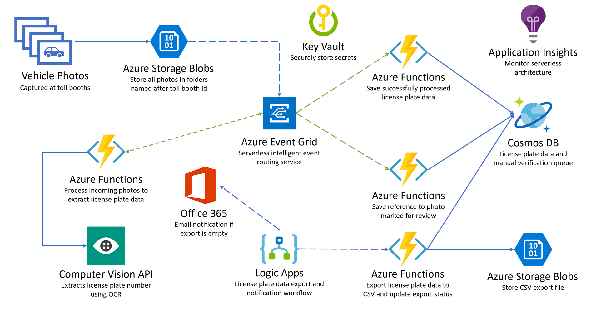
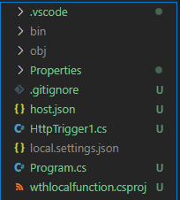
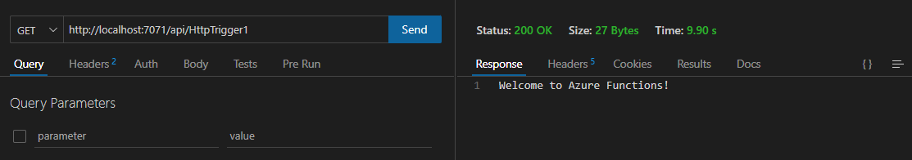
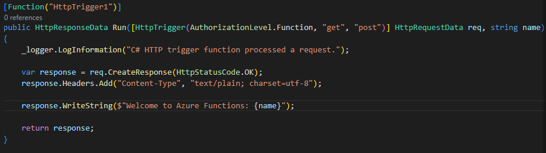
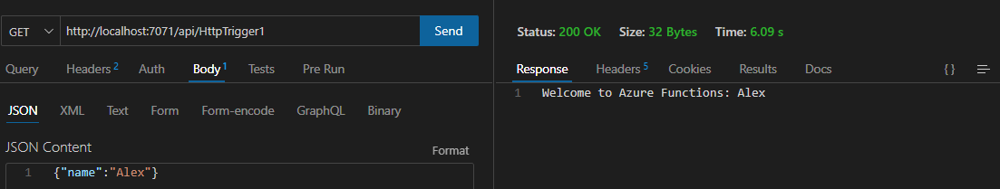
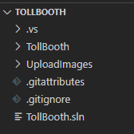
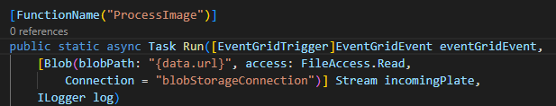

# Azure_Serverless-WTH

architecting a serverless solution on Azure for the use case of a Tollbooth Application that needs to meet demand for event driven scale.

## Learning Objectives:
In this hack, you will be solving the business problem of event driven scale for the Tollbooth Application.

Provision an Azure Storage Blob Container to store vehicle photos.
Set up Azure Functions to process the vehicle photos leveraging Event Grid.
Use Cognitive Services Computer Vision API OCR to comprehend the license plate data from the vehicle photos.
Store the license plate data in Azure Cosmos DB.
Provision a Logic App for obtaining the stored license plate data from Cosmos DB and exporting it to a new CSV file saved to Blob storage.
Use Application Insights to monitor the Azure Functions in real-time as data is being processed through the serverless architecture.

## Solution Architecture:
The solution begins with vehicle photos being uploaded to an Azure Storage blob storage container, as they are captured. A blob storage trigger fires on each image upload, executing the photo processing Azure Function endpoint (on the side of the diagram), which in turn sends the photo to the Cognitive Services Computer Vision API OCR service to extract the license plate data.

If processing was successful and the license plate number was returned, the function submits a new Event Grid event, along with the data, to an Event Grid topic with an event type called "savePlateData". However, if the processing was unsuccessful, the function submits an Event Grid event to the topic with an event type called "queuePlateForManualCheckup".

Two separate functions are configured to trigger when new events are added to the Event Grid topic, each filtering on a specific event type, both saving the relevant data to the appropriate Azure Cosmos DB collection for the outcome, using the Cosmos DB output binding.

A Logic App that runs on a 15-minute interval executes an Azure Function via its HTTP trigger, which is responsible for obtaining new license plate data from Cosmos DB and exporting it to a new CSV file saved to Blob storage. If no new license plate records are found to export, the Logic App sends an email notification to the Customer Service department via their Office 365 subscription.

Application Insights is used to monitor all of the Azure Functions in real-time as data is being processed through the serverless architecture. This real-time monitoring allows you to observe dynamic scaling first-hand and configure alerts when certain events take place.

Below is a diagram of the solution architecture you will build in this hack. Please study this carefully, so you understand the whole of the solution as you are working on the various components.

The Solution diagram is described in the text following this diagram.

## Technologies used:
Azure services and related products leveraged to create this one possible solution architecture are:

Azure Functions
Azure Cognitive Services
Azure Event Grid
Application Insights
Azure Cosmos DB
Azure Key Vault
Logic Apps
Azure Solution

## Challenge 01 - Prepare workstation to develop the Serverless Solution:

### Pre-requisites
Your laptop: Win, MacOS or Linux OR A development machine that you have administrator rights.
Active Azure Subscription with contributor level access or equivalent to create or modify resources.

### Introduction
The first challenge is to setup an environment that will help you build the Tollbooth application and deploy it locally. We need to make sure everything is working before bringing it to Azure.

### Description
Set up local environment:

[Node.js 8+](https://nodejs.org/en/download) LTS version wich also installs NPM.
        After installing we can test it by typing in the CMD: node --version
[.NET 6 SDK](https://dotnet.microsoft.com/en-us/download/dotnet/6.0)
        After installing we can test it by typing in the CMD: dotnet --version
[Azure Functions Core Tools](https://learn.microsoft.com/en-us/azure/azure-functions/functions-run-local?tabs=windows%2Cisolated-process%2Cnode-v4%2Cpython-v2%2Chttp-trigger%2Ccontainer-apps&pivots=programming-language-csharp)
    After installing we can test it by typing in the CMD: func --version
[Visual Studio Code](https://code.visualstudio.com/)

VS Code extensions:
[Todo Tree Extension](https://marketplace.visualstudio.com/items?itemName=Gruntfuggly.todo-tree).
[Azure account](https://marketplace.visualstudio.com/items?itemName=ms-vscode.azure-account).
[Azure functions](https://marketplace.visualstudio.com/items?itemName=ms-azuretools.vscode-azurefunctions).
[Azure resources](https://marketplace.visualstudio.com/items?itemName=ms-azuretools.vscode-azureresourcegroups).
[C#](https://marketplace.visualstudio.com/items?itemName=ms-dotnettools.csharp).
[Thunder Client](https://marketplace.visualstudio.com/items?itemName=rangav.vscode-thunder-client)

How to [setup Azure Functions on Visual Studio Code](https://learn.microsoft.com/en-us/azure/azure-functions/functions-develop-vs-code?tabs=node-v3%2Cpython-v2%2Cisolated-process&pivots=programming-language-csharp).

The [source code and supporting files for this hack](https://aka.ms/serverless-september/wth/resources).

## Challenge 02 - Create a Hello World Function:
Create a “Hello World” Azure Function in Visual Studio Code that:
    Takes a name as an input parameter.
    Returns the name back to you as an output.
    Verify that you are able to open your function in a browser and pass your name in the query string.
    You should see a message like: Hello, YourName. This HTTP triggered function executed successfully.
    Understand the basic parts of an Azure Function’s code and how to publish it to Azure.
    [Azure Functions Overview](https://learn.microsoft.com/en-us/azure/azure-functions/functions-overview?pivots=programming-language-csharp)

    Steps:
    Created a new folder called "local function".
    Access it and enter visual studio code: code .
    Went to the Azure extension -> Workplace (Local) -> Create Function -> The local folder -> C# -> .NET 6.0 ([Isolated LTS](https://learn.microsoft.com/en-us/azure/azure-functions/dotnet-isolated-process-guide)) -> HTTP trigger -> Leave everything as default -> Function.
        This creates the following files & folders.

        Press f5 to trigger debug mode.
        The output will give us the local URL of the function.
    Accessed Thunder client -> New Request -> pasted the URL.

    Edited the HttpTriger1.cs file to include our name in the HTML:

After changing it we can send our name as part of the JSON Body content:

## Challenge 03: Create Resources
Provision the basic resources in Azure to prepare your deployment ground, in the same region.

    1. Created a resource group: whatthehack-rg
    2. Created an Azure Cosmos DB for NoSQL: whatthehack-cosmos
        Serverless, the rest as default
    3. Created a storage account: whatthehackinit1
    4. Created two containers: images & export
    5. Created a new Function App: tollboothapp1
        .NET, 6, allowed it to create a new storage account, disabled application insights
    6. Created a new Function App: tollboothevents1
        Node.js, 18 LTS, allowed it to create a new storage account, disabled application insights
    7. Accessed the Cosmos DB account -> Data Explorer -> New container
        Database ID "LicensePlates", Container ID "Processed", Partition key : "/licensePlateText"
    8. Created another container using the same Database ID as above
        Database ID "LicensePlates", Container ID "NeedsManualReview", Partition key : "/fileName"
    9. Created an Event Grid topics: whatthehacktopic1
        Event Schema: Event Grid Schema
    10. Created a Computer vision: whatthehackvision1
        Pricing tier: Standard S1
    11. Created a key vault: whatthehackvault1
        Pricing Tier : Standard
    12. Configured the tollboothapp1 Function App to use key vault for secrets
        tollboothapp1 -> Identity -> System Assigned -> On
        This is used for Azure services to connect to other Azure services by giving it an identity
    13. whatthehackvault1 -> Access control (IAM) -> Created two policies that enable tollboothapp1 to read from the key vault
        Role: Key Vault Crypto Officer
        Members: Managed identity, Managed identity: Function App, Select: tollboothapp1
        Role: Key Vault Secrets Officer
        Members: Managed identity, Managed identity: Function App, Select: tollboothapp1
    14. whatthehackvault1 -> Secrets -> Created secrets -> Generate/Import
        Name: computerVisionApiKey, Secret value: Get from "Keys and Endpoint" in the resource
        Name: eventGridTopicKey, Secret value: Get from "Access keys" in the resource
        Name: cosmosDBAuthorizationKey, Secret value: Get from "Keys" in the resource (Read-write keys)
        Name: blobStorageConnection, Secret value: Get from "Access keys" in the resource (Connection string)

### Learning Resources:
[Creating a storage account (blob hot tier)](https://learn.microsoft.com/en-us/azure/storage/common/storage-account-create?toc=%2Fazure%2Fstorage%2Fblobs%2Ftoc.json%23create-a-storage-account&tabs=azure-portal)
[Creating a function app](https://learn.microsoft.com/en-us/azure/azure-functions/functions-create-function-app-portal)
[Concepts in Event Grid](https://learn.microsoft.com/en-us/azure/event-grid/concepts)
[Creating an Azure Cosmos DB account](https://learn.microsoft.com/en-us/azure/cosmos-db/how-to-manage-database-account)
[Key Vault Secret Identifiers](https://learn.microsoft.com/en-us/azure/key-vault/general/about-keys-secrets-certificates)
[Configure Azure Functions and KeyVault to work together](https://learn.microsoft.com/en-us/azure/app-service/app-service-key-vault-references?tabs=azure-cli#granting-your-app-access-to-key-vault)

## Challenge 04: Configuration
Configure application settings on the Microsoft Azure Portal and update the TollBooth application code
Application settings are encrypted at rest and transmitted over an encrypted channel
Application Settings are exposed as environment variables for access by your application at runtime.
This is what the function will use to pull the keys in the key vault.
Save after each change.

    1. tollboothapp1 Function App -> Configurations -> New Application setting
        Name: computerVisionApiUrl, Value: Get URL from "Keys and Endpoint" in the resource & append "vision/v2.0/ocr" to the end 
        Name: computerVisionApiKey, Value: "Secret identifier" from the Secret in the Key Vault & append "@Microsoft.KeyVault(SecretUri=" to the start
        Name: eventGridTopicEndpoint, Value: "Topic Endpoint" from Overview in the resource
        Name: eventGridTopicKey, Value: "Secret identifier" from the Secret in the Key Vault & append "@Microsoft.KeyVault(SecretUri=" to the start
        Name: cosmosDBEndPointUrl, Value: "URI" from Overview in the resource
        Name: cosmosDBAuthorizationKey, Value: "Secret identifier" from the Secret in the Key Vault & append "@Microsoft.KeyVault(SecretUri=" to the start
        Name: cosmosDBDatabaseId, Value: LicensePlates
        Name: cosmosDBCollectionId, Value: Processed
        Name: exportCsvContainerName, Value: export
        Name: blobStorageConnection, Value: "Secret identifier" from the Secret in the Key Vault & append "@Microsoft.KeyVault(SecretUri=" to the start

    2. Opened the tollboth folder in visual studio code

    3. Typed the following to download all the packages needed that the .csproj file shows: dotnet restore
    4. Opened the Todo Tree Extension
    5. Opened the ProcessImage.cs file
        Noticed that the Run method is decorated with the FunctionName attribute, which sets the name of the Azure Function to "ProcessImage".

        This is triggered by HTTP requests sent to it from the Event Grid service.
        You tell Event Grid that you want to get these notifications at your function's URL by creating an event subscription in which you subscribe to blob-created events.
        The function's trigger watches for new blobs being added to the images container of the storage account that was created in Exercise 1.
        The data passed to the function from the Event Grid notification includes the URL of the blob.
        That URL is in turn passed to the input binding to obtain the uploaded image from Blob storage.

    6. Added the following under the TODO1: licensePlateText = await new FindLicensePlateText(log, _client).GetLicensePlate(licensePlateImage);
    7. Opened the FindLicensePlateText.cs file
        This class is responsible for contacting the Computer Vision API to find and extract the license plate text from the photo, using OCR.
        Notice that this class also shows how you can implement a resilience pattern using Polly, an open source .NET library that helps you handle transient errors.
        This is useful for ensuring that you do not overload downstream services, in this case, the Computer Vision API.
    8. Added the following under the TODO2:
        var uriBase = Environment.GetEnvironmentVariable("computerVisionApiUrl");
        var apiKey = Environment.GetEnvironmentVariable("computerVisionApiKey");
        These correspond to the Application Settings that were added earlier
    9. Opened the SendToEventGrid.cs file
        This class is responsible for sending an Event to the Event Grid topic, including the event type and license plate data.
        Event listeners will use the event type to filter and act on the events they need to process.
        Make note of the event types defined here (the first parameter passed into the Send method), as they will be used later on when creating new functions in the second Function App you provisioned earlier.
    10. Added the following under TODO3: await Send("savePlateData", "TollBooth/CustomerService", data);
    11. Added the following under TODO4: await Send("queuePlateForManualCheckup", "TollBooth/CustomerService", data);

[Reference key vault from app service](https://learn.microsoft.com/en-us/azure/app-service/app-service-key-vault-references?tabs=azure-cli)

Challenge 05: Deployment
Deploy the Tollbooth project to the “App” in the Azure Portal Function App and configure the Event Grid
Challenge 06: Create Functions in the Portal
Create the event triggered functions in the Azure Portal to respond to Event Grid Topics
Challenge 07: Monitoring
Configure application monitoring with Application Insights Resource on Azure Portal
Challenge 08: Data Export Workflow
Deploy a Logic App to periodically export the license plate data and conditionally send an email

## Optional Challenges
Challenge 07A: Scale the Cognitive Service
Witness the dynamic scaling of the Function App demonstrating the true Serverless behaviour
Challenge 07B: View Data in Cosmos DB
Use the Azure Cosmos DB Data Explorer in the portal to view saved license plate data

## Prerequisites
Your laptop: Win, MacOS or Linux OR A development machine that you have administrator rights.
Active Azure Subscription with contributor level access or equivalent to create or modify resources.
Node.js 8+: Install latest long-term support (LTS) runtime environment for local workstation development. A package manager is also required. Node.js installs NPM in the 8.x version. The Azure SDK generally requires a minimum version of Node.js of 8.x. Azure hosting services, such as Azure App service, provides runtimes with more recent versions of Node.js. If you target a minimum of 8.x for local and remove development, your code should run successfully.
Visual Studio 2022 or Visual Studio Code
Azure development workload for Visual Studio 2022
Azure Functions and Web jobs tools
.NET 6 SDK
Any extentions required by your language of choice
To setup Azure Functions on Visual studio Code, follow this guide.